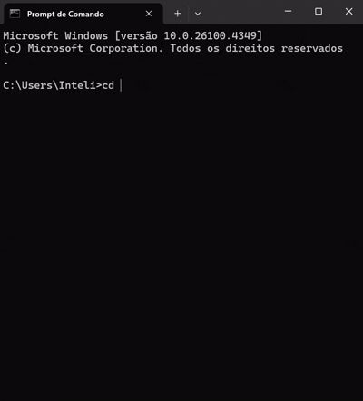

# Bootloader em Assembly

# **Aplicação rodando:**



## Descrição
Bootloader real em Assembly x86 que utiliza real mode da BIOS para ler entrada do usuário, concatenar com frase pré-estabelecida e exibir resultado na tela.

## Pré-requisitos (Windows)
- **Assembler**: NASM 2.16.03 ou superior
- **Download**: https://www.nasm.us/pub/nasm/releasebuilds/
- **Instalação**: Extrair e adicionar ao PATH
- **Compilador C**: GCC/TDM-GCC (para versão demonstrativa)

## Fluxo da Aplicação
1. **Inicialização**: Configura segmentos e limpa tela usando BIOS
2. **Entrada**: Lê nome do usuário caractere por caractere via int 16h
3. **Processamento**: Trata teclas especiais (Enter, Backspace)
4. **Concatenação**: Combina "Ola, " + nome digitado em Assembly
5. **Saída**: Exibe resultado usando int 10h da BIOS

## Código Principal (Assembly Real Mode)
```assembly
; Configuração real mode da BIOS
[BITS 16]           ; Modo 16-bit
[ORG 0x7C00]        ; Endereço padrão bootloader

; Leitura de entrada usando BIOS
mov ah, 0x00        ; Read key
int 0x16            ; Chama BIOS (resultado em AL)

; Impressão usando BIOS  
mov ah, 0x0E        ; Print char
int 0x10            ; Chama BIOS

; Assinatura obrigatória bootloader
times 510-($-$$) db 0
dw 0xAA55
```

## Como Executar

### 1. Configurar PATH do NASM
```cmd
set PATH=%PATH%;C:\Users\Inteli\AppData\Local\bin\NASM
```

### 2. Compilar Bootloader Assembly
```cmd
nasm -f bin bootloader.asm -o bootloader.bin
```

### 3. Verificar Arquivo Gerado
```cmd
dir bootloader.bin
```
Deve ter exatamente **512 bytes** (tamanho padrão de setor de boot).

### 4. Demonstrar Funcionamento
```cmd
bootloader.exe
```
(Versão em C que demonstra o comportamento do bootloader Assembly)

## Exemplo de Uso
```
Digite seu nome: Pablo
Ola, Pablo
```

## Estrutura do Projeto
```
bootloader-projeto/
├── README.md
├── bootloader.asm       # Código Assembly principal
├── bootloader.bin       # Bootloader compilado (512 bytes)
├── bootloader.c         # Versão demonstrativa em C
└── bootloader.exe       # Executável para demonstração
```

## Arquivos do Repositório
- `bootloader.asm` - Código fonte Assembly (obrigatório)
- `bootloader.bin` - Bootloader compilado de 512 bytes
- `README.md` - Documentação do projeto
- `bootloader.c` - Versão demonstrativa em C
- `bootloader.exe` - Executável para demonstração